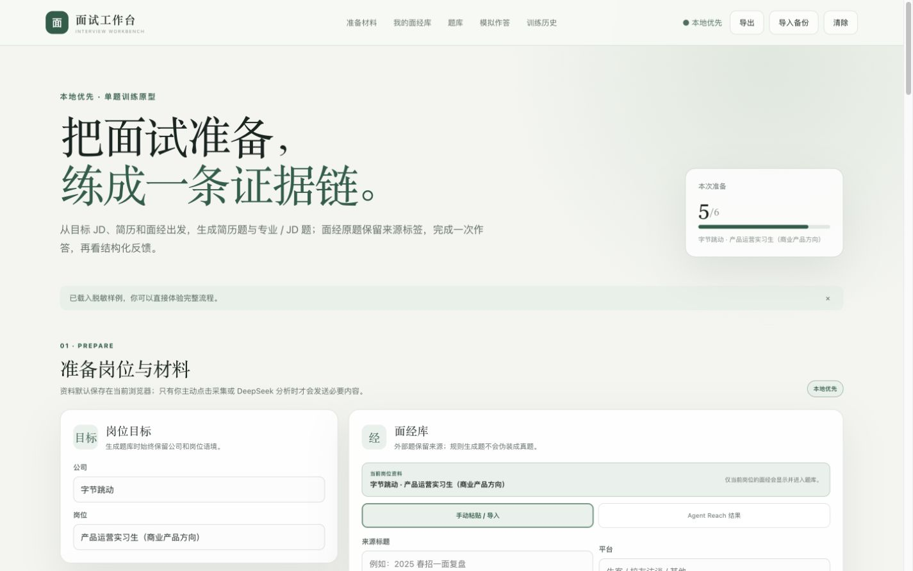

# 面试工作台

把目标岗位、JD、简历和面经整理成一套可追溯的面试题库。逐题作答，接受一次针对性追问，再用 DeepSeek 检查回答中的证据、事实缺口和表达问题。



这是一个本地优先的单用户工具。没有 DeepSeek Key 或 OpenCLI，也可以使用材料导入、本地简历解析、本地规则组题、单题训练和完整备份恢复。

## 可以完成什么

- 按“公司＋岗位”保存 JD、简历、面经来源、题库和训练记录，切换岗位时资料不会混用。
- 从 JD、简历和面经生成两类题库。面经原题保留来源标签，规则题和 AI 衍生题不会冒充真题。
- 每次只练一道题。首轮回答后最多再追问一次，第二轮结束后自动封闭并保存记录。
- 上传 `.txt`、`.md`、`.docx` 和文字型 `.pdf` 简历，在浏览器中转为可编辑文字。
- 导出完整 JSON 备份，在新电脑或新浏览器中预览并恢复。
- 可选接入 DeepSeek 智能组题和证据审阅，也可选接入 OpenCLI 进行有界的小红书面经采集。

## 快速开始

需要 Node.js 22 或更高版本。

```bash
git clone https://github.com/mengfanfreyachan/interview-workbench.git
cd interview-workbench
npm install
npm run dev
```

打开终端显示的本机地址，默认是 [http://localhost:4173](http://localhost:4173)。工作台不需要账号、数据库或云端部署。

也可以从 [Releases](https://github.com/mengfanfreyachan/interview-workbench/releases) 下载源码。

## 一次完整使用

1. 填写目标公司和岗位，粘贴或导入 JD。
2. 上传简历，粘贴面经，或导入已有来源记录。
3. 先运行本地规则组题。如果已经配置 DeepSeek，也可以继续智能组题。
4. 从题库选择一道题，完成回答和最多一次追问。
5. 在右上角导出 JSON，保存本机数据备份。

仓库首次启动会载入一套虚构、脱敏的产品运营样例，可以直接体验完整流程。

## DeepSeek 可选

DeepSeek 用于智能组题和回答审阅。使用者需要提供自己的 API Key。

最简单的方式是在“模拟作答”区域点击“配置自己的 Key”。Key 会交给当前电脑上的开发服务，只保存在进程内存中。它不会写入浏览器数据、备份、日志或 Git，停止 `npm run dev` 后失效。

维护者也可以复制环境变量示例。

```bash
cp .env.example .env.local
```

```dotenv
DEEPSEEK_API_KEY=your_private_key
DEEPSEEK_INTERVIEW_MODEL=deepseek-v4-pro
```

修改 `.env.local` 后需要重新启动开发服务。只有在用户主动点击 DeepSeek 按钮时，当前操作需要的岗位、材料、题目和回答才会发送给模型服务。

## OpenCLI 面经采集可选

小红书面经采集依赖本机 OpenCLI、Chrome 和使用者已有的平台登录状态。工作台不会保存 Cookie，也不会替用户登录、绕过验证码或规避平台风控。

一次采集最多执行 6 组查询，读取不超过 20 个新来源，并在连续两轮没有新增来源、达到数量上限或总时限后停止。它只执行用户主动发起的前台只读操作，不包含后台无人值守任务，也不会评论、点赞或发布内容。

没有 OpenCLI 时，可以继续手动粘贴面经，或导入 `.txt`、`.md` 和符合数据格式的 JSON。

遇到登录墙、Chrome 连接或文件解析问题时，查看[常见问题与排障](./docs/TROUBLESHOOTING.md)。

## 本地数据和备份

工作台数据保存在当前地址对应的浏览器 `localStorage` 中，存储键为 `xiangqian.interview-workbench.v6`。代码目录、Git 仓库和 `npm install` 都不包含这些数据。

更换电脑、浏览器或端口，清理网站数据，或卸载项目前，请先点击右上角的“导出”。新环境启动后点击“导入备份”，检查公司岗位数、来源数和训练记录数，再确认完整恢复。

导入采用完整替换。损坏或无法迁移的文件不会覆盖现有数据。DeepSeek Key 不进入备份，需要在新环境重新配置。

## 当前边界

- 面向单用户本机运行，不提供账号、云同步或多人共享。
- 扫描版、图片型和加密 PDF 暂不解析，旧版 `.doc` 需要先另存为 `.docx`。
- 浏览器语音识别是否可用，取决于浏览器实现和权限设置。
- 面经采集是有界搜索，覆盖报告用于说明实际查询范围，不承诺穷尽平台内容。
- 静态网页部署不包含本机 DeepSeek 和 OpenCLI 桥接能力。

## 开发与文档

开发命令、测试范围和架构入口见[开发说明](./docs/DEVELOPMENT.md)。证据审阅协议见 [`INTERVIEW_EVIDENCE_REVIEW_V1.md`](./docs/INTERVIEW_EVIDENCE_REVIEW_V1.md)。迁移和历史决策见 [`HANDOFF.md`](./HANDOFF.md)。

```bash
npm run check
npm test
npm run test:ui
npm run build
```

当前版本为 `v0.1.0`。干净环境验收通过 125 项测试、类型检查和正式构建。

## 许可与第三方关系

本项目按 [MIT License](./LICENSE) 开源，与 DeepSeek、小红书、Agent Reach 或 OpenCLI 没有隶属、授权或背书关系。第三方名称只用于说明可选集成能力，其商标和服务归各自权利人所有。

使用者需要自行遵守所在地法律、第三方平台条款、API 规则和内容权利边界。请勿提交无权处理的个人信息、商业秘密或其他敏感内容，也不要把采集能力用于批量、无人值守或绕过平台限制的操作。
